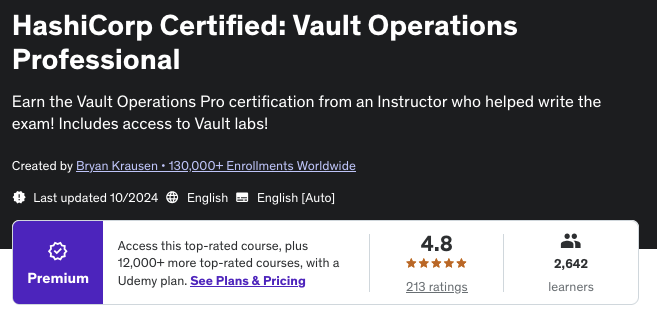
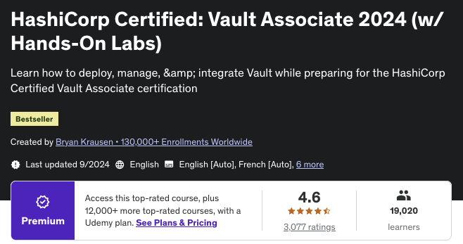
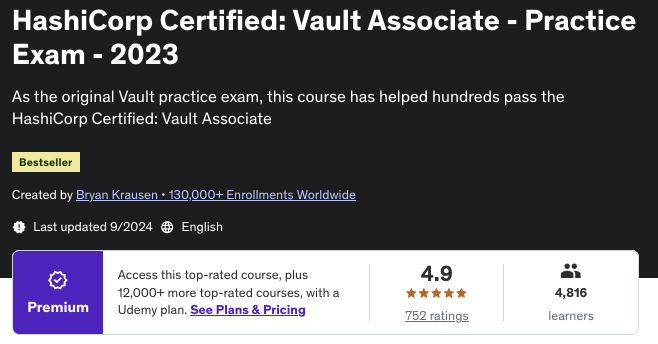

#### What is this repo about?
- just a study guide about Hashicorp Vault 
- points that I gathered for the Vault Certification 
- want to study together; add some points that are missing 

Let us challange each other - learn this and be better tomorrow 

My Study Approach: 
- In studying to the Vault test (was advised by a co-worker to get both Associate and Professional Vault Certifications) am “exploiting each single practice test question” and making “my own study guide”

Courses Used for this:

