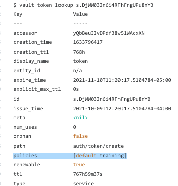
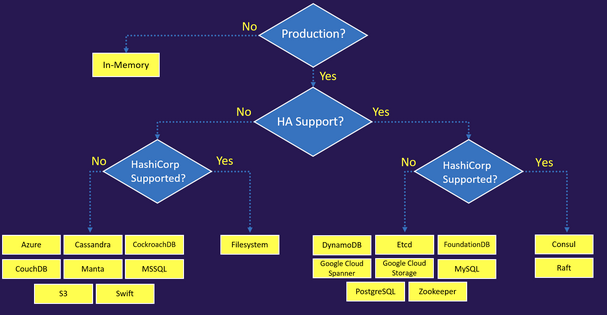
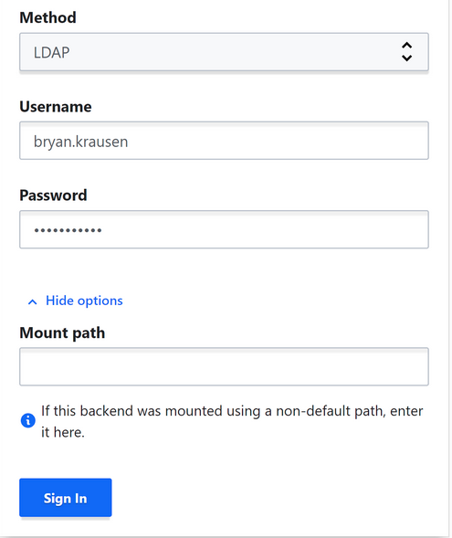
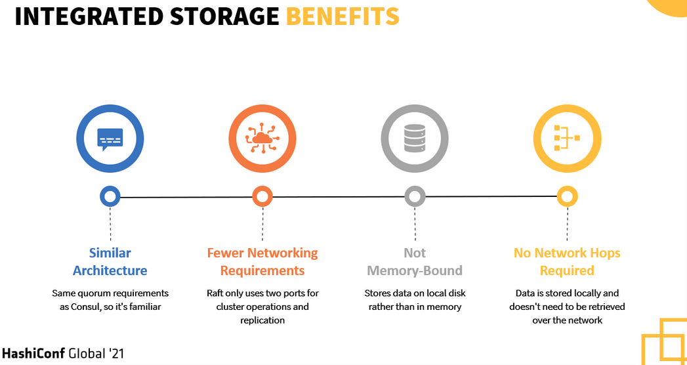

46 Using the CLI how can you see what policies are attached to the current token

##### vault token lookup

47 Authentication Methods as Vault 1.8
  - AppRole
  - AliCloud
  - AWS
  - Azure
  - Cloud Foundry
  - GitHub
  - Google Cloud
  - JWT/OIDC
  - Kerberos
  - Kubernetes
  - LDAP
  - Oracle Cloud Infrastructure
  - Okta
  - RADIUS
  - TLS Certificates
  - Tokens
  - Username and Password

48 Batch Tokens in Vault - 2 key facts  
1. batch tokens are not persisted (written) to storage
2. batch tokens are not valid accross all clusters using Vault Enterprise Replications 
https://developer.hashicorp.com/vault/docs/concepts/tokens#batch-tokens

49 Vault supports a wide variety of storage backends. You need high availability and can you choose any of the available storage backends?  Not all backends are equal; consul & raft/integrated are the best:
##### Storage Backeneds"

50 Vault instances, or clusters, include two built-in policies that are created automatically. What are they?
1. The default policy is created automatically. This policy can be modified but not deleted.
2. The root policy is created automatically. This policy provides superuser privileges and cannot be deleted.

51 CI/CD in Terraform to AWS and currently uses privileged credentials that were manually created in AWS and are valid 24/7. Improve using Vault and limit the access to AWS only when it's needed.

- enable the AWS secrets engine and instruct Terraform to dynamically generate a short-lived AWS credential on each terraform apply.
https://developer.hashicorp.com/vault/docs/secrets/aws

52 Your organization has enabled the LDAP auth method on the path of corp-auth/. When you access the Vault UI, you cannot log in despite providing the correct credentials. Based on the screenshot below, what action should you take to log in?

Select More Options and enter the Mount path that LDAP was enabled on (corp-auth/)

##### See "Mount path"

53 Select the benefits the organization would see by using Integrated Storage over other storage backends 
1. simplified troubleshooting since Integrated Storage is a built-in solution
2. eliminates the requirement to deploy and manage a separate platform for storing encrypted data
3. immediate access to storage since the data is stored locally on disk
4. reduces operational overhead since all configuration is within Vault itself

https://developer.hashicorp.com/vault/docs/configuration/storage/raft
https://developer.hashicorp.com/vault/tutorials/raft

54 It is TRUE a rekey operation using the vault operator rekey command creates new unseal/recovery keys as well as a new master key.

The operator rekey command generates a new set of unseal keys. This can optionally change the total number of key shares or the required threshold of those key shares to reconstruct the master key. This operation is zero downtime, but it requires that Vault is unsealed and a quorum of existing unseal keys are provided.

https://developer.hashicorp.com/vault/tutorials/operations/rekeying-and-rotating

55 Vault can use a root token. Select the valid methods from below
1. running the command vault token create when using a valid root token
2. generating a root token using a quorum of recovery keys when using Vault auto unseal
3. initializing Vault when first creating the cluster by using vault operator init
https://developer.hashicorp.com/vault/docs/concepts/tokens#root-tokens

56 Human based auth methods are better suited for human-based access?
1. OIDC
2. GitHub 
3. Userpass
4. LDAP
5. Okta
https://developer.hashicorp.com/vault/tutorials/getting-started/getting-started-authentication#github-authentication

57 Which of the following are considered benefits of using policies in Vault? (select three)
1. policies have an implicit deny, meaning that policies are deny by default
2. policies provide Vault operators with role-based access control
3. provides granular access control to paths within Vault
https://developer.hashicorp.com/vault/tutorials/policies/policies
<pre>
There are many benefits to using Vault policies, including:

  - provides granular access control to paths within Vault to control who can access certain paths inside Vault

  - policies have an implicit deny, meaning that policies are deny by default - no policy means no authorization

  - policies provide Vault operators with role-based access control so you can ensure users only have access to the paths required
</pre>